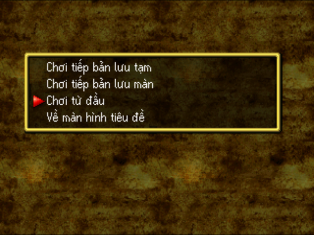
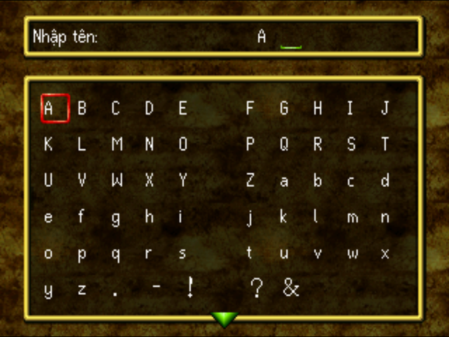
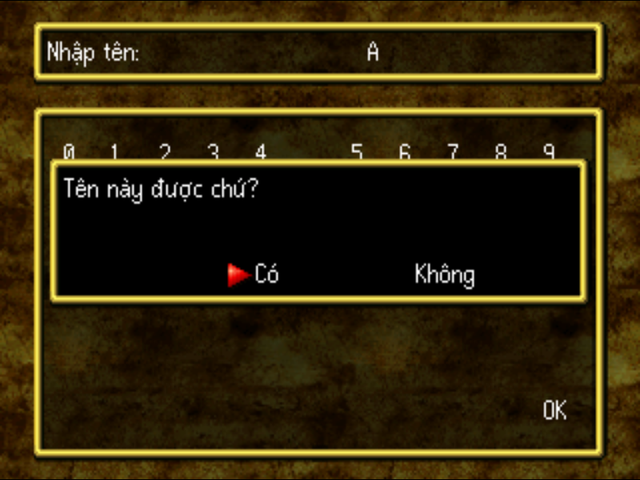
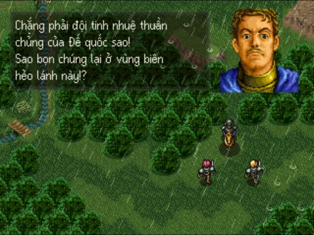
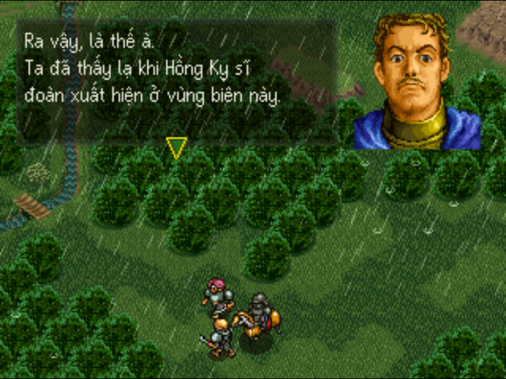
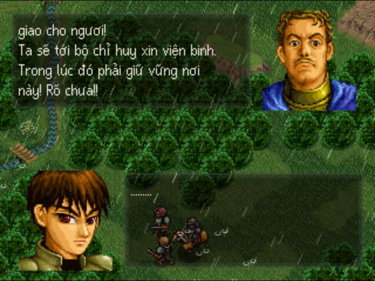

# Riot Stars — bản dịch tiếng Việt

Bản vá (patch) Việt hoá cho trò chơi PlayStation 1 *Riot Stars* (Hect, 1997,
mã đĩa **SLPS-00829**, bản Nhật).

Đây là dự án của người hâm mộ, không liên quan tới Hect. Gói này **không chứa**
đĩa gốc hay dữ liệu của trò chơi. Bạn cần có ảnh đĩa gốc của chính mình; bản vá
chỉ ghi phần chữ tiếng Việt, phông chữ và mã hiển thị chữ lên ảnh đĩa đó.

Nội dung gói:

| File | Dùng để |
|---|---|
| `riot-stars-vi.rsvi` | Bản vá |
| `apply_patch.py` | Trình áp vá bằng Python, tự kiểm SHA-256 trước và sau, tự tạo `.cue` |
| `tao_cue.bat` | Tạo file `.cue` đúng tên cho file `.bin` (kéo thả hoặc nháy đúp) |
| `README.md` | Hướng dẫn này |

---

## Hình ảnh

| | |
|---|---|
|  |  |
| Menu đầu game | Màn nhập tên, bảng chữ Latin |
|  |  |
| Hộp xác nhận tên | Thoại trong trận đầu |
|  |  |
| Hai khung thoại cùng lúc | Tên nhân vật chính chèn vào lời thoại |

Ảnh chụp trên DuckStation với OpenBIOS.

## Những gì đã Việt hoá

- Toàn bộ lời thoại phần phiêu lưu và các trận đánh, tên nhân vật, lớp, vật
  phẩm, kỹ năng, phép, menu, hộp thoại, thông báo thẻ nhớ.
- Màn nhập tên dùng bảng chữ Latin.
- Sòng bạc và đua ngựa: lời thoại, menu, tên ngựa.
- Chữ vẽ sẵn trên menu bản đồ và dòng chữ chạy ở trường đua.
- Phông chữ có dấu, rộng hẹp theo từng chữ (VWF).

Không dịch: tên nhân viên ở phần credit trong phim cuối game (chữ in sẵn
trong video).

Giới hạn của máy: cửa sổ trạng thái trong trận dùng phông nhỏ của game, vốn
chỉ có chữ hoa không dấu, nên tên đơn vị, lớp, vật phẩm ở đó viết HOA không dấu.

## 1. Chuẩn bị ảnh đĩa gốc

Cần ảnh đĩa dạng **`.bin` + `.cue`** (Mode 2, 2352 byte mỗi sector) của đĩa
Nhật SLPS-00829, đúng **một file `.bin`**. File `.iso` (2048 byte mỗi sector)
không dùng được.

- Kích thước đúng của `.bin`: **151.713.408 byte** (64.504 sector).

## 2. Kiểm SHA-256 của ảnh đĩa gốc

Ảnh đĩa gốc phải cho ra đúng:

```
18a138b66ee070ce96a0c6aa559176a4631780e5c52d415289aaef99e2b8479f
```

**Windows (cmd):** `certutil -hashfile "TEN_FILE.bin" SHA256`

**Windows (PowerShell):** `Get-FileHash "TEN_FILE.bin" -Algorithm SHA256`

**macOS:** `shasum -a 256 "TEN_FILE.bin"` — **Linux:** `sha256sum "TEN_FILE.bin"`

Chỉ cần so 8 ký tự đầu: đĩa gốc đúng bắt đầu bằng `18a138b6`.

## 3. Áp vá (Windows, macOS, Linux)

Cần Python 3 (python.org; trên Windows khi cài nhớ tick "Add Python to PATH").
Trình áp vá **không sửa** file gốc mà tạo file mới, và tự kiểm SHA-256.

1. Đặt `apply_patch.py`, `riot-stars-vi.rsvi` và file `.bin` gốc vào cùng một thư mục.
2. Mở cmd / PowerShell / Terminal tại thư mục đó và chạy:

```
python apply_patch.py "TEN_FILE_GOC.bin"
```

(Trên macOS/Linux nếu `python` không có thì dùng `python3`.)

Chương trình tạo `Riot Stars (VN).bin` và `Riot Stars (VN).cue` ngay cạnh file
gốc, rồi báo
**KHOP ban phat hanh** nếu mọi thứ đúng. SHA-256 của đĩa đã vá:

```
179b2301aae96619a26e26a77b4adf45e23d39401a2ae6bb4a38bea29c1ff568
```

Vì sao không dùng PPF: bản Việt cần nhiều chỗ hơn, nên vài file được dời về cuối
đĩa. PPF chỉ ghi byte, sẽ phải chứa nguyên các file đó (tức là dữ liệu game).
Định dạng `.rsvi` chỉ ghi "lấy sector nào của đĩa gốc" và phần chữ Việt, nên gói
vá không chứa dữ liệu game.

## 4. Chơi

Mở `Riot Stars (VN).cue` bằng giả lập PS1 (DuckStation, PCSX-Redux, ePSXe…) hoặc
ghi ra đĩa CD-R. Nếu chỉ có file `.bin`, dùng `tao_cue.bat` để tạo `.cue`.

Không có BIOS gốc: DuckStation chạy được với OpenBIOS (BIOS mã nguồn mở đi kèm
PCSX-Redux), đặt file `openbios.bin` vào thư mục BIOS của DuckStation.

## 5. Báo lỗi

Khi báo lỗi hãy ghi kèm: SHA-256 đĩa gốc, giả lập đang dùng, và ảnh chụp màn hình.
